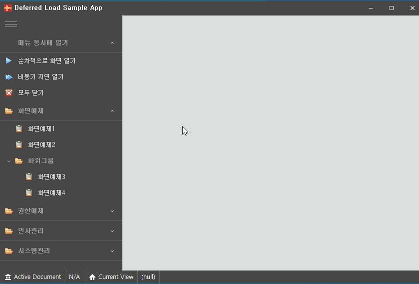
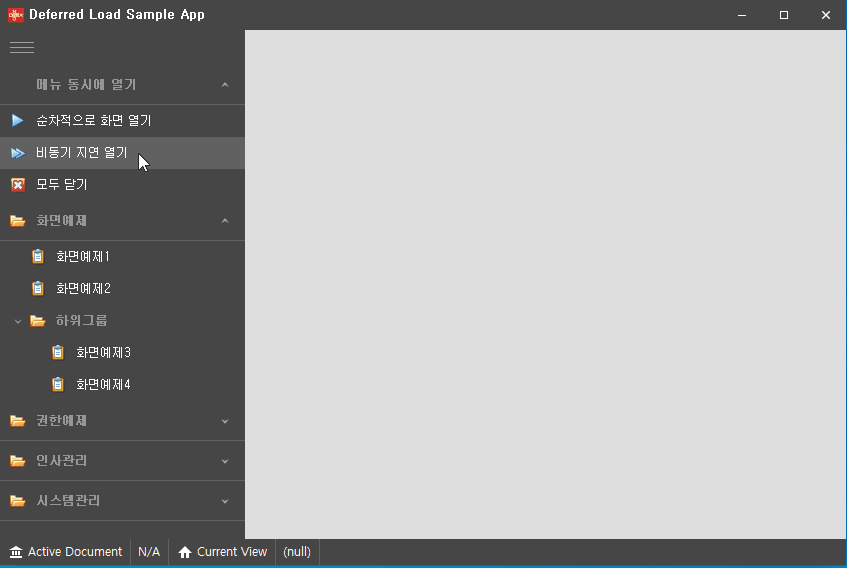

# Deferred Load Example

NeoDEEX를 사용하여 메뉴를 작성할 때 뷰(화면)를 지연 로드(deferred load)하는 방법에 대해 소개하는 예제 입니다.

> * 이 예제는 NeoDEEX 4.5.4 버전 이상을 필요로 합니다.
> * 이 예제는 DevExpress DocumentManager의 [Deferred Load](https://documentation.devexpress.com/WindowsForms/11619/Controls-and-Libraries/Application-UI-Manager/Deferred-Load/Deferred-Load) 기능을 사용합니다.
> * 이 예제는 DevExpress 19.1.x 버전을 사용하였지만 이전 버전들이나 최신 버전에도 작동합니다.

## 개요

NeoDEEX에서 화면(뷰)를 열기 위해서 [`FoxMenuViewModel`](https://github.com/NeoDEEX/manual/blob/master/uimodel/menuview.md#FoxMenuViewModel) 클래스의 `SelectMenu` 혹은 `OpenMenu` 메서드를 호출하면 됩니다. 이 두 메서드는 주어진 화면을 나타내는 클래스의 인스턴스를 생성하고 화면을 메뉴 뷰([`IFoxMenuView`](https://github.com/NeoDEEX/manual/blob/master/uimodel/menuview.md#IFoxMenuView))에게 통지하여 로드하도록 합니다.

일반적으로 이러한 과정은 문제를 유발하지 않습니다. 하지만 때때로 여러 개의 화면을 동시에 로드해야 하는 상황이 발생합니다. 대표적인 예로, 어플리케이션 시작 시 이전에 사용자가 사용했던 화면을 다시 로드 하는 기능을 제공할 때 입니다. 이 때, 이들 화면을 모두 열기 위해서는 각 화면이 모두 열릴 때까지 사용자는 기다려야 합니다. 한 화면이 열리는데 시간이 오래 걸린다면 UX 관점에서 좋지 못한 결과가 나오게 됩니다. 다음 이미지는 이러한 상황을 보여 줍니다.



이러한 문제를 해결하기 위해 사용자가 특정 화면(탭)을 선택할 때 해당 화면을 여는 지연 열기(deferred loading) 기법을 사용할 수 있습니다. 다음은 지연 열기를 사용하는 예를 보여 줍니다.



NeoDEEX 4.5.4 버전부터 이러한 상황에서 사용할 수 있도록  `CreateViewModel` 메서드를 제공합니다. 구체적인 사용방법은 다음과 같습니다.

```cs
private void TabbedView1_QueryControl(object sender, QueryControlEventArgs e)
{
    var menuInfo = e.Document.Tag as FoxMenuItem;
    if (menuInfo != null)
    {
        var viewModel = _menuViewModel.CreateViewModel(menuInfo);
        e.Control = viewModel.View as Control;
    }
}
```

`QueryContrl` 이벤트는 사용자가 화면 탭을 클릭하여 화면 로드가 필요할 때 발생하는 DevExpress의 DocumentManager 컴포넌트의 이벤트 입니다. 이 이벤트 핸들러에서 `CreateViewModel` 메서드를 호출하여 뷰 모델을 생성하고 이 뷰 모델과 함께 생성된 뷰(화면)을 제공하여 지연 로드를 수행하게 됩니다.

상세한 예제는 소스를 참고하십시오.

---
