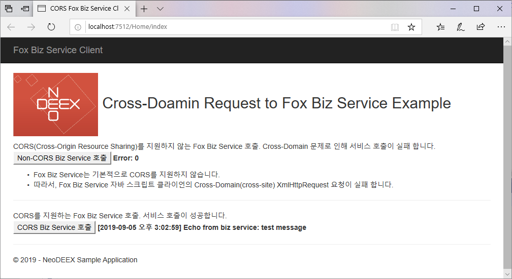

# Fox Biz/Data Service CORS Sample

[Fox Biz Service](https://github.com/NeoDEEX/manual/tree/master/webservice/bizservice)/[Fox Data Service](https://github.com/NeoDEEX/manual/tree/master/webservice/dataservice) 구현 시 발생할 수 있는 크로스 도메인(Cross-Domain) 혹은 크로스 오리진(Cross-Origin) 문제를 해결하는 CORS(Cross-Origin Resource Sharing)를 적용하는 예제 입니다.



## 개요

크로스 도메인 문제는 AJAX 호출(XMLHttpRequest 객체)이 자바 스크립트 소스의 원본과 다른 도메인을 호출할 수 없다는 보안 제약 때문에 발생합니다. 예를 들어 브라우저에서 `http://server1/index.htm`를 브라우징했고 이 페이지에서 AJAX를 통해 `http://server2/webapi`를 호출한 경우, Same Origin Policy를 위반한 것으로 간주되어 AJAX 호출이 실패 합니다.

크로스 도메인 문제를 해결하는 방법은 다양하게 존재할 수 있지만 CORS를 사용하는 것이 권장됩니다. CORS에 대한 상세한 내용은 다음 문서를 참고 하십시오.

> [HTTP 접근 제어 (CORS)](https://developer.mozilla.org/ko/docs/Web/HTTP/Access_control_CORS)

## ASP.NET WebAPI CORS

Fox Biz/Data Service는 ASP.NET WebAPI를 기반으로 구현되었습니다. 따라서 ASP.NET Web API에 CORS를 적용하는 방법을 사용하여 Fox Biz/Data Service에 CORS를 적용할 수 있으며 응용도 가능합니다. 다음 문서는 ASP.NET Web API에 CORS를 적용하는 방법을 설명하는 문서 입니다.

> [Enable cross-origin requests in ASP.NET Web API 2](https://docs.microsoft.com/en-us/aspnet/web-api/overview/security/enabling-cross-origin-requests-in-web-api)

## Fox Biz Service에 CORS 적용

이 예제는 Fox Biz Service에 CORS를 적용하는 예제 입니다. 예제는  2개의 웹 어플리케이션인 [AppWeb 프로젝트](./AppWeb)와 [ServiceWeb 프로젝트](./ServiceWeb)로 구성되어 있습니다.

ServiceWeb 프로젝트는 Fox Biz Service를 제공하며 CORS가 적용된 예제 입니다. AppWeb 프로젝트는 ServiceWeb 프로젝트를 호출하는 웹 어플리케이션입니다. ServiceWeb 에 CORS가 적용되지 않은 경우, AppWeb에서 ServiceWeb의 Fox Biz Service를 호출하는 JavaScript는 오류를 유발합니다.

Fox Biz Service에 CORS에 적용하는 방법은 다음과 같습니다.

* Fox Biz Service를 호스팅하는 웹 프로젝트에 `Microsoft.AspNet.WebApi.Cors` 패키지를 NuGet에서 추가합니다.

* [`WebApiConfig.cs`](./ServiceWeb/App_Start/WebApiConfig.cs) 파일에서 `config.EnableCors` 메서드 호출을 추가합니다.

    ```cs
    public static void Register(HttpConfiguration config)
    {
        // Web API configuration and services

        // CORS 기능 활성화
        config.EnableCors();

        ... 생략 ...
    }
    ```

* `FoxBizServiceController` 클래스에서 파생된 컨트롤러 클래스([`CorsBizServiceController`](./ServiceWeb/Controllers/CorsBizServiceController.cs))를 추가 합니다.

* 추가된 컨트롤러 클래스에 `EnableCorsAttribute` 특성을 추가하고 적설한 설정을 수행합니다.

    ```CS
    [EnableCors(origins: "http://localhost:7512,http://localhost.fiddler:7512", headers: "*", methods: "*")]
    public class CorsBizServiceController : TheOne.ServiceModel.Web.Http.Controllers.FoxBizServiceController
    {
    // 구현할 내용이 전혀 없습니다.
    }
    ```

    > 주: 추가된 컨트롤러에 어떤 코드도 추가할 필요가 없습니다.

* 추가된 컨트롤러를 위한 라우팅 설정을 [`WebApiConfig.cs`](./ServiceWeb/App_Start/WebApiConfig.cs)에 추가합니다.

    ```cs
    public static void Register(HttpConfiguration config)
    {
        ... 생략 ...

        // CORS를 지원하지 않는 Fox Biz Service 컨트롤러 라우팅
        config.Routes.MapHttpRoute(
            name: "FoxBizService",
            routeTemplate: "api/bizservice/{action}",
            defaults: new { controller = "FoxBizService" }
        );

        // CORS를 지원하는 Fox Biz Service 컨트롤러 라우팅
        config.Routes.MapHttpRoute(
            name: "CorsFoxBizService",
            routeTemplate: "api/cors/bizservice/{action}",
            defaults: new { controller = "CorsBizService" }
        );
    }
    ```

* Fox Data Service 역시 동일한 방법으로 CORS 적용이 가능합니다.

---
