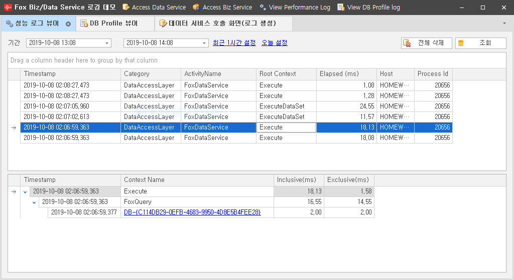
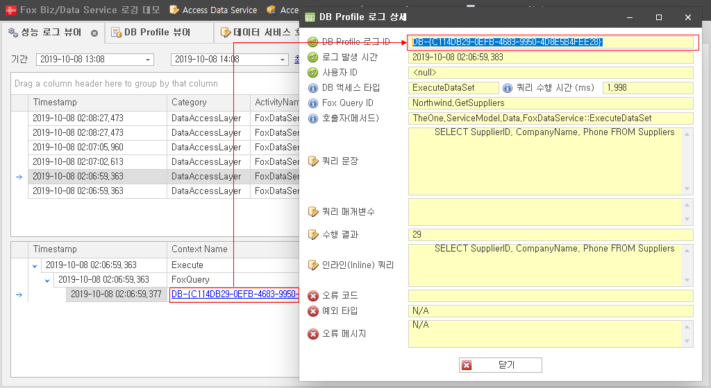
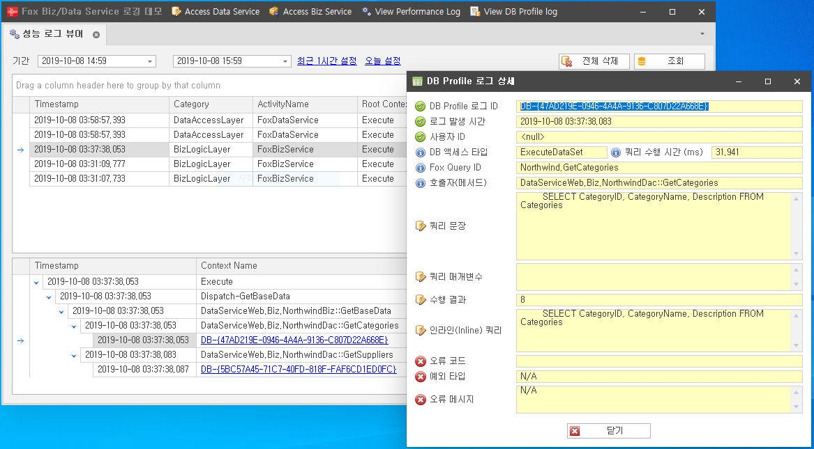

# Fox Biz/Data Service 성능 로깅 예제

NeoDEEX 4.5.4 버전부터 추가된 Fox Biz Service 및 Fox Data Service의 성능 로깅 기능에 대한 예제 입니다.

## 개요

Fox Biz/Data Service는 초기 개발 때부터 성능 정보를 수집하여 클라이언트에게 반환해 주는 기능을 제공했었습니다. 하지만 이러한 기능은 어플리케이션의 문제점을 찾기 위한 진단 성격이 강했으며 대량의 성능 정보를 기록하여 통계적으로 성능 진단을 하기에는 부적합했습니다.

예를 들어, *평일 오전9시~10시 사이에 평균적으로 응답 속도가 500ms을 초과하는 서비스 호출은 어떤 것인가*라는 질문에 대답하기 위해서는 평일동안 수행되는 거의 모든 서비스에 대한 성능 정보를 DB에 기록해 두어야 합니다. 기존의 진단 기능으로서 클라이언트에게 반환되는 성능 정보는 서비스 측의 진단 기능을 활성화 해야하며 클라이언트로 반환된 성능 정보 데이터를 다시 서버로 전송하여 DB에 저장해야 하기 때문에 대단히 비효율적이게 됩니다.

따라서 NeoDEEX 4.5.4 버전부터는 Fox Biz/Data Service에서 간단한 구성 설정을 통해 성능 정보를 DB에 기록할 수 있게 되었습니다.

## 성능 정보 로깅 설정

NeoDEEX 구성 설정에서 `<bizService>` 혹은 `<dataService>` 요소의 하위 요소로 `<perfLog>` 요소가 추가되었습니다. 이 요소의 `enable` 속성을 `true`로 지정하고 `loggerName` 속성에 로거 이름을 지정하면 해당 로거에 성능 정보가 기록됩니다.

다음은 Fox Data Service에 성능 로그를 활성화하여 텍스트 파일에 기록하는 예를 보여 줍니다.

```xml
<service>
  <dataService>
    <perfLog enable='true' loggerName='PerformanceLog' />
  </dataService>
</service>
<logging>
  <loggers>
    <logger name="PerformanceLog" providerType="TheOne.Diagnostics.Loggers.FoxTextFileLoggerProvider">
      <property name="directory" value="D:\Logging"/>
      <property name="fileprefix" value="PerformanceLog"/>
    </logger>
  </loggers>
</logging>
```

## 성능 정보 DB 기록

`FoxTextFileLogger`나 `FoxDbLogger`를 사용하는 경우, 성능 정보가 단순히 텍스트로 기록되기 때문에 통계적으로 성능 정보를 분석하기 어렵습니다. 따라서 성능 정보를 구성하는 `FoxPerformanceActivityInfo` 객체를 기록할 수 있는 커스텀 로거를 작성해야 합니다.

이 예제는 `FoxLoggerBase` 클래스에서 파생된 [`PerformanceInfoDbLogger` 클래스](./CommonLib/PerformanceInfoDbLogger.cs)를 작성하여 성능 정보를 DB에 기록하는 예를 보여주고 있습니다. 다음 화면은 기록된 성능 로그를 조회하는 예제 화면을 보여 줍니다.



Fox Biz/Data Service가 생성하는 성능 로그를 DB에 기록하기 위해서는 로거에 전달된 `FoxPerformanceActivityInfo` 객체의 내용을 DB에 기록하는 코드를 작성해야 합니다.

```cs
// FoxLoggerBase 핵심 메서드 구현
protected override void WriteLog(string source, FoxLogLevel level, object data)
{
    var activityInfo = data as FoxPerformanceActivityInfo;
    if (activityInfo != null)
    {
        WriteActivityInfo(activityInfo);
    }
}

// 성능 활동 정보를 DB에 기록한다.
private void WriteActivityInfo(FoxPerformanceActivityInfo activityInfo)
{
    // ... 생략 ...
}
```

이제 Fox Biz/Data Service가 생성하는 성능 정보가 `PerformanceInfoDbLogger` 로거를 사용하도록 구성 설정을 수행하면 됩니다.

```xml
<service>
  <dataService>
    <perfLog enable="true" loggerName="PerfLogger"/>
  </dataService>
</service>
<logging>
  <loggers>
    <logger name="PerfLogger" providerType="CommonLib.PerformanceInfoDbLoggerProvider, CommonLib" filter="Information">
      <property name="ConnectionStringName" value="Northwind"/>
      <property name="ActivityQueryId" value="PerformanceLog.InsertActivityInfo"/>
      <property name="ContextQueryId" value="PerformanceLog.InsertContextInfo"/>
    </logger>
  </loggers>
</logging>
```

## 성능 정보와 DB Profile과의 연동

Fox Biz/Data Service가 생성하는 성능 정보를 포함하여 NeoDEEX가 측정하는 성능 정보 내에 DB 프로파일이 포함되는 경우, 성능 정보와 DB 프로파일 정보는 연동이 가능합니다. DB 프로파일은 Fox DB Access에 의해 DB 액세스가 수행되는 경우, 수행된 쿼리, 매개변수, 수행 시간 등의 정보를 기록합니다. 이때, DB 프로파일 정보의 Id가 생성되며 이 Id는 성능 정보의 성능 문맥으로 기록됩니다. 따라서 성능 문맥의 이름을 사용하여 DB 프로파일을 추적하는 것이 가능합니다.



이 예제에는 Fox Biz/Data Service가 수행되는 동안 DB 프로파일을 DB에 기록하는 로거가 포함되어 있습니다([`DbProfileDbLogger.cs`](CommonLib/DbProfileDbLogger.cs)). 이 로거를 통해 DB에 기록된 DB 프로파일과 성능 정보에 기록된 성능 정보의 연동하는 예를 확인하십시오.

> 이 예제에는 Fox Data Service 뿐만 아니라 Fox Biz Service에 대한 성능 로깅 예제 역시 포함하고 있습니다. 다음은 Fox Biz Service를 호출했을 때 발생하는 성능 로그를 보여 줍니다.
>
> 

---
