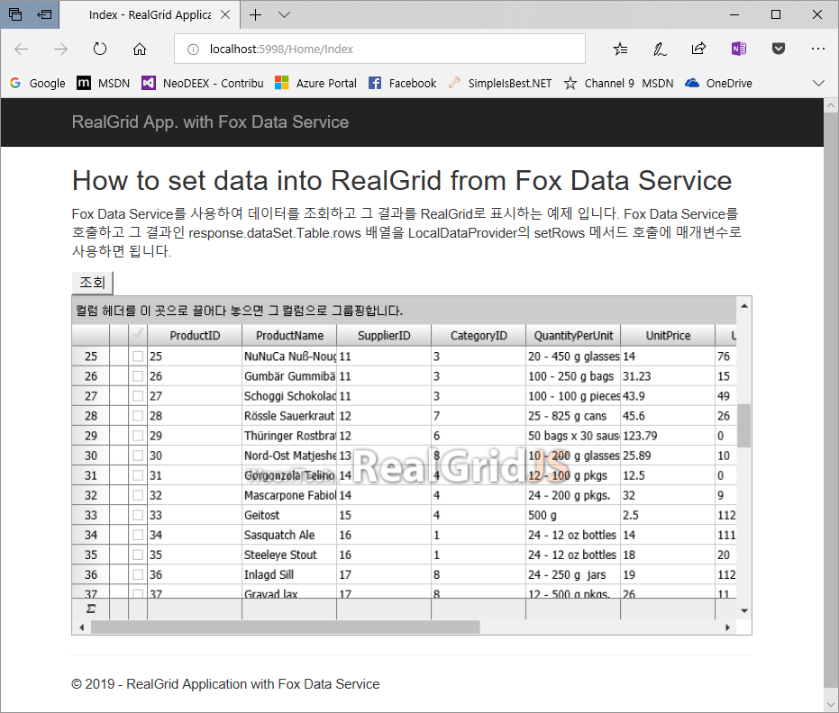

# RealGrid Example using Fox Data Service

[Fox Data Service](https://github.com/NeoDEEX/manual/tree/master/webservice/dataservice/introduction.md)를 사용하여 데이터를 조회하고 그 결과를 [RealGrid](https://www.realgrid.com/)에 바인딩하는 예제 입니다.



> 주의: RealGrid 예제를 구동하기 위해서는 RealGrid 라이선스 파일(realgridjs-lic.js)이 필요합니다. 이 예제에 포함된 라이선스는 개발용이며 2019년 5월 22일까지만 유요합니다. 갱신된 라이선스를 획득하기 위해서는 [RealGrid](https://www.realgrid.com/)와 연락하시기 바랍니다.

RealGrid에 데이터를 바인딩하기 위해서는 `LocalDataProvider` 객체의 `setRows` 함수를 호출해야 합니다. Fox Data Service가 반환하는 `FoxDataResponse` 객체의 JSON 포맷은 `setRows` 함수에 직접 사용이 가능합니다.

다음은 데이터를 조회하는 Fox Data Service가 반환하는 JSON 응답의 예 입니다.

```json
{
    "success": true,
    "elapsedMilliseconds": 3,
    "dataSet": {
        "Table": {
            "name": "Table",
            "columns": [
                {
                    "name": "ProductID",
                    "type": "int",
                    "ordinal": 0
                },
                {
                    "name": "ProductName",
                    "type": "string",
                    "ordinal": 1
                }
            ],
            "rows": [
                {
                    "ProductID": 1,
                    "ProductName": "Chai",
                },
                {
                    "ProductID": 2,
                    "ProductName": "Chang"
                },
                {
                    "ProductID": 3,
                    "ProductName": "Aniseed Syrup"
                }
            ]
        }
    }
}
```

조회 결과가 여러 테이블을 포함한다면 Table1, Table2 등이 추가될 수도 있습니다. 각 Table은 테이블 이름(`name` 속성)과 컬럼 정보(`columns` 속성) 그리고 row 배열(`rows` 속성)이 포함되어 있습니다. 여기서 row 배열을 RealGrid에 직접 바인딩 할 수 있습니다.

> Table, Table1, Table2 등은 `DataSet` 내부에 사용된 `DataTable`의 이름입니다. 현재 Fox Data Service에서 이 테이블 이름을 변경할 수 있는 방법은 없습니다. 다만, Fox Biz Service를 사용하면 임의의 테이블 이름으로 조회가 가능합니다.

다음 코드는 Fox Data Service를 호출하고 그 결과를 RealGrid에 바인딩하는 예제 코드 입니다. 상세한 내용은 [index.cshtml](RealGridApp/Views/Home/Index.cshtml) 코드를 참조 하십시오.

```csharp
// Fox Data Service를 호출하고 호출 결과를 RealGrid에 바인딩하여 결과를 표시한다.
function getData() {
    var client = new FoxRestDataClient("/api/dataservice");
    var request = new FoxDataRequest();
    request.queryId = "Northwind.GetAllProducts";
    client.executeDataSet(request, function (response) {
        var table = response.dataSet.Table;
        // 오류 패널 감추기
        $("#error_panel").hide();
        // 컬럼 생성 (optional)
        populateColumns(table);
        // 데이터 바인딩
        dataProvider.setRows(table.rows);
    },
    function (errorInfo) {
        $("#error_message").text(errorInfo.Message);
        $("#error_detail").text(errorInfo.MessageDetail);
        $("#error_stacktrace").text(errorInfo.StackTrace);
        // 오류 패널 표시
        $("#error_panel").show();
    });
}
```

> 이 예제는 Fox Data Service를 사용하지만 Fox Biz Service를 호출하고 그 결과가 DataSet이라면 동일한 방식으로 RealGrid에 그 결과를 표시할 수도 있습니다.

---
