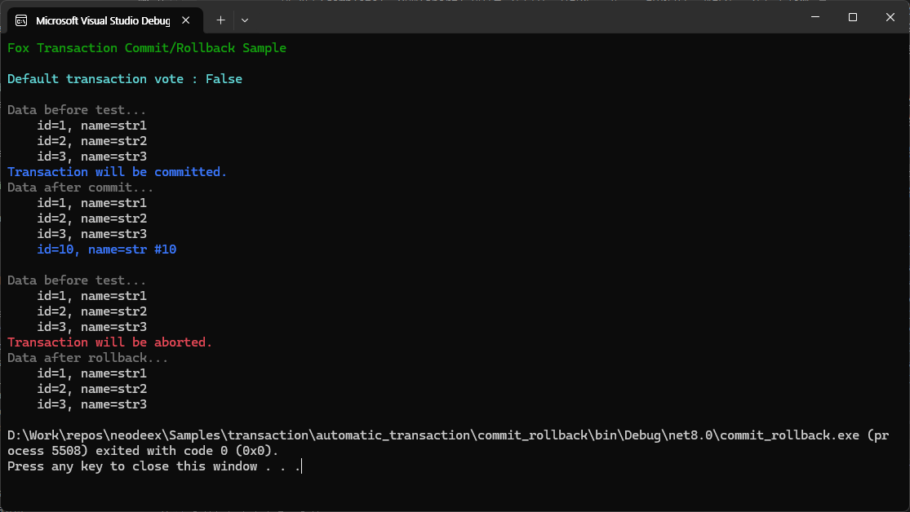

# Fox Transactions 자동 트랜잭션 예제

[Fox Transactions](https://neodeex.github.io/doc/transaction/) 에서 제공하는 자동 트랜잭션(automatic transaction) 기능을 보여주는 예제 입니다.

[자동 트랜잭션](https://neodeex.github.io/doc/transaction/automatic_transaction/)은  `FoxAutoCompleteAttribute` 특성을 사용하여 트랜잭션 메서드의 예외 발생 여부에 따라 트랜잭션의 성공(complete), 실패(abort) 여부를 자동으로 처리하는 기능을 말합니다. 개발자는 자동 트랜잭션 기능을 통해 트랜잭션을 시작하거나 커밋 혹은 롤백하는 코드를 직접 작성할 필요가 없게 됩니다.

수동 트랜잭션이라 함은 예외 발생 여부와 무관하게 `SetComplete`/`SetAbort` 메서드를 직접 호출하여 트랜잭션의 성공/실패 여부를 지정하는 방식을 말합니다.

이 예제는 자동 트랜잭션과 수동 트랜잭션의 예를 보여 줍니다. `AutcoCompleteMethod` 는 자동 트랜잭션을, `ManualCompleteMethod` 는 수동 트랜잭션을 사용합니다. 이 두 메서드는 `forceRollback` 매개변수를 통해 커밋 혹은 롤백 여부를 지정할 수 있습니다. 

```cs
// 테스트 전 데이터 출력
AnsiConsole.MarkupLine("[gray]Data before test...[/]");
DumpTestData(test_id);
// 롤백을 수행하는 메서드 호출
//itf.AutcoCompleteMethod(test_id, true);
itf.ManualCompleteMethod(test_id, true);
// 롤백 확인을 위해 테스트 데이터 출력
AnsiConsole.MarkupLine("[gray]Data after commit...[/]");
DumpTestData(test_id);
AnsiConsole.WriteLine();
```


---
