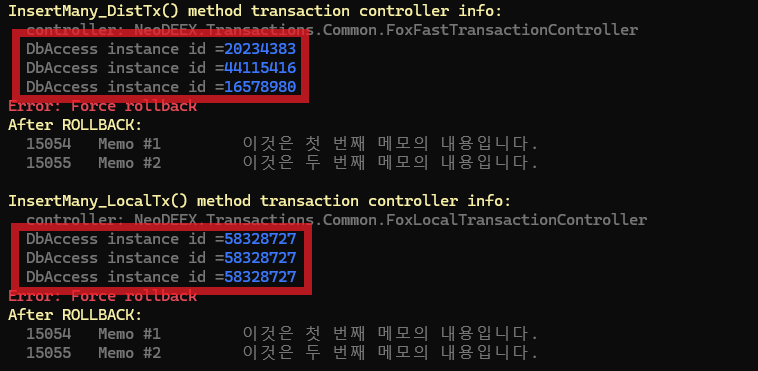

# Fox Transactions - Transaction Controller Sample

Fox Transactions 에서 트랜잭션을 시작하거나 참여하고 트랜잭션 메서드 수행 결과에 따라 트랜잭션을 커밋/롤백하는 주체를 트랜잭션 컨트롤러라 부르며 `IFoxTransactionControl` 인터페이스를 구현하는 객체 입니다. 트랜잭션 클래스/메서드는 `FoxTransactionControllerAttribute` 특성을 사용하여 기본적으로 제공되는 세 종류의 트랜잭션 컨트롤러 중 하나를 선택할 수 있습니다.

* `FastTransaction` 컨트롤러와 `TransactionScope` 컨트롤러는 `System.Transactions` 네임스페이스의 API 를 사용하여 트랜잭션을 제어 합니다.

* `LocalTransaction` 컨트롤러는 ADO.NET 의 트랜잭션 API를 사용하여 트랜잭션을 제어 합니다. 본적인 작동 원리는 트랜잭션 내에서 하나의 `FoxDbAccess` 객체를 공유하여 로컬 트랜잭션을 사용하도록 하는 것입니다.

	

	예제 코드에서 트랜잭션 내에서 여러 메서드 호출에 `FoxDbAccess` 객체가 유지되는 것을 확인할 수 있습니다.

	

* `Custom` 컨트롤러는 `IFoxTransactionControl` 인터페이스를 구현한 사용자가 정의한 트랜잭션 컨트롤러를 사용하는 방식입니다. 이 에제에서 `CustomController` 클래스가 커스텀 트랜잭션 컨트롤러로서 `IFoxTransactionControl` 인터페이스의 메서드가 호출되는지 콘솔에 출력합니다.

Fox Transactions 의 트랜잭션 컨트롤러에 대한 상세한 내용은 다음 문서를 참고하십시요.

* [트랜잭션 컨트롤러](https://neodeex.github.io/doc/transaction/transaction_controllers/)

---
