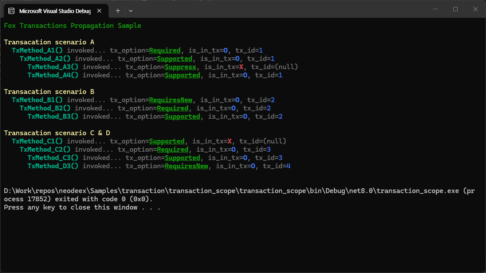

# Fox Transactions - Transaction Propagation Sample

Fox Transactions 에서 트랜잭션은 트랜잭션 루트에서 시작되며 트랜잭션 메서드들을 호출함에 따라 트랜잭션이 전파(propagation)되어 트랜잭션의 영역(scope)이 결정됩니다. 트랜잭션 전파와 트랜잭션 영역에 대한 상세한 내용은 다음 문서를 참고 하십시요.

* [트랜잭션 전파와 영역](https://neodeex.github.io/doc/transaction/transaction_scope/)

이 예제는 위 그림과 같은 상황의 트랜잭션 전파 시나리오에 대한 코드를 포함하고 있습니다. 각 메서드의 트랜잭션 참여 여부(`is_in_tx`) 출력값과 트랜잭션 아이디(`tx_id`) 출력값을 통해 트랜잭션 메서드가 어떤 트랜잭션에 참여하는지 확인이 가능합니다.

---