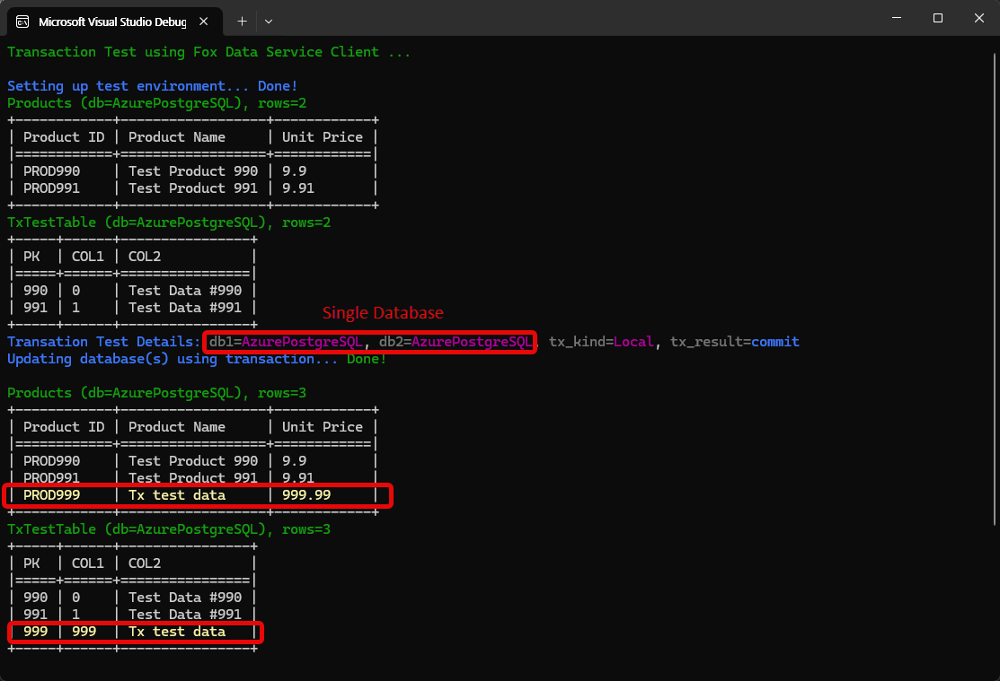
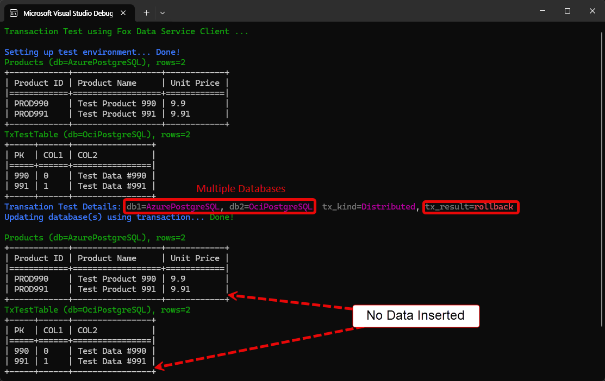

# Fox Data Sevice Transaction Sample

이 예제 코드는 Fox Data Service 의 트랜잭션 기능을 사용하는 예제 코드입니다. Fox Data Service 의 트랜잭션 기능에 대한 상세한 설명은 [Fox Data Service 트랜잭션 기능](https://neodeex.github.io/doc/webapi/dataservice/adv_usage#transaction) 문서를 참고하시기 바랍니다.

* `foxwebapi_app` 프로젝트

	Fox Web API 기능을 사용하여 Fox Data Service 를 호스팅하는 웹 API 프로젝트입니다.

* `api_client` 프로젝트
	
	Fox Web API 클라이언트 기능을 사용하여 원격 Fox Data Service(`foxwebapi_app`)를 호출하는 콘솔 애플리케이션 프로젝트입니다. 

## 테스트 방법

테스트가 잘 작동하기 위해서는 `foxwebapi_app` 프로젝트를 수행하여 ASP.NET 웹 API 가 먼저 수행되어야 합니다. Fox Data Service 가 구동되면 `api_client` 프로젝트를 수행하면 데이터베이스에 테스트 환경을 설정(데이터 추가 등)하고 테스트 대상이 되는 2개의 테이블의 내용을 표시하고 트랜잭션을 사용하여 데이터를 추가하고 트랜잭션 이후 테이블 내용을 출력합니다.



로컬 트랜잭션을 사용하기 위해서는 `api_client` 프로젝트의 `Main` 메서드에서 `isLocalTx` 로컬 변수를 `true` 로 설정하면 됩니다.

```cs
bool isLocalTx = true;
```

로컬 트랜잭션이 사용되면 이 예제는 단일 PostgreSQL 데이터베이스의 `product` 테이블과 `txtesttable` 테이블에 각각 1건의 데이터를 추가 합니다. 위 화면은 로컬 트랜잭션이 성공적으로 커밋된 후의 테이블 내용을 보여줍니다.

한편 `isLocalTx` 로컬 변수를 `false` 로 설정하면 분산 트랜잭션이 사용됩니다. 분산 트랜잭션이 사용되면 2개의 서로 다른 PostgreSQL 데이터베이스의 `product` 테이블과 `txtesttable` 테이블에 각각 1건의 데이터를 추가 합니다.

```cs
bool isLocalTx = false;
```

오류로 인해 트랜잭션이 롤백되는 상황을 테스트 하기 위해 `force_rollback` 로컬 변수를 `true` 로 설정하면 됩니다. 이 경우 트랜잭션이 롤백되므로 2개의 테이블 모두에 데이터가 추가되지 않습니다.

```cs
bool forceRollback = true;
```

다음은 분산 트랜잭션에서 롤백이 수행되어 2개의 테이블 모두에 데이터가 추가되지 않은 상황을 보여줍니다.



## 고려 사항

닷넷 환경에서 분산 트랜잭션은 MSDTC 라는 복잡한 환경 설정을 요구합니다. 예를 들어, 원격 호스트에 존재하는 SQL Server 데이터베이스를 대상으로 분산 트랜잭션을 수행하기 위해서는 SQL Server 호스트 측의 MSDTC(Microsoft Distributed Transaction Coordinator) 서비스가 활성화되어 있어야 하며 RPC 통신이 가능해야 합니다. MSDTC 서비스가 활성화와 RPC 통신은 복잡한 네트워크 설정을 요구합니다(Fox Data Service 와 동일한 서버에 존재하는 SQL Server 에 대한 분산 트랜잭션은 별다른 설정을 요구하지 않습니다).

한편, Oracle 데이터베이스를 대상으로 분산 트랜잭션을 수행하기 위해서는 ODP.NET Core 23.9 이상 버전이 필요하며, 분산 트랜잭션에서 격리 수준으로 Read Committed 만을 지원합니다.

이 테스트에서 PostgreSQL 데이터베이스를 사용한 이유는 PostgreSQL 데이터베이스는 MSDTC 서비스나 MTS 기능을 요구하지 않기 때문입니다. 따라서 PostgreSQL 데이터베이스를 대상으로 분산 트랜잭션을 수행하는 것이 가장 간단합니다. 하지만 PostgreSQL 데이터베이스는 MSDTC 를 위한 완전한 2PC(Two-Phase Commit) 분산 트랜잭션을 지원하지 않으므로 트랜잭션 도중에 서버가 종료되는 등으로 트랜잭션이 커밋되거나 롤백되지 않고 고아(orphan) 상태가 될 수 있습니다. 따라서 PostgreSQL 데이터베이스를 대상으로 분산 트랜잭션을 수행할 때는 이러한 점을 고려해야 합니다.

온 프레미스 환경에서는 분산 트랜잭션 환경을 구축하는 것이 가능하지만 클라우드 환경에서는 분산 트랜잭션 환경을 구축하는 것이 어렵습니다. 따라서 클라우드 환경에서는 분산 트랜잭션을 사용하지 않고 로컬 트랜잭션만 사용하거나 오류 발생 시 수동으로 롤백하는 방식을 사용하는 것이 좋습니다.

---
