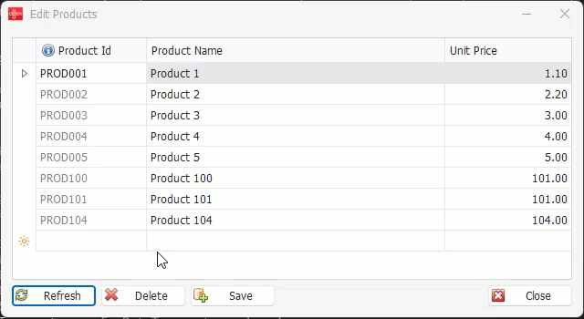

# Fox Data Service Web API WinForm Client Sample

이 예제는 Fox Web API(ASP.NET Web API) 를 통해 원격 웹 서버의 Fox Data Service 를 호출하는 WinForm 클라이언트 샘플입니다.

* webapi_app 프로젝트

    Fox Web API 를 사용하여 Fox Data Service 를 호스팅하여 원격 클라이언트에서 호출할 수 있도록 합니다. 이 프로젝트는 MVC 컨트롤러를 사용하지 않는 Minimal Web API 스타일의 프로젝트로서 `Program.cs` 에서 다음 코드 조각이 Fox Data Service Web API 를 호스팅 하도록 구성되어 있습니다.

    ```cs
    app.MapPost("api/dataservice/{action}", (string? action, HttpRequest request) =>
    {
        return request.DispatchDataService(action);
    });
    ```

* desktop_client 프로젝트

    Fox Web API 클라이언트 라이브러리인 `NeoDEEX.ServiceModel.WebApi.Client` 패키지를 사용하여 Fox Data Service Web API 를 호출하는 WinForm 클라이언트 샘플입니다. 특히, 이 코드에는 `SaveDataTable` 메서드를 통해 변경된 여러 행을 한 번에 서버로 전송하여 데이터베이스에 반영하는 예제가 포함되어 있습니다.

    `SaveDataTable` 메서드 사용방법에 대한 상세한 내용은 [Fox Data Service 고급 사용 가이드 문서](https://neodeex.github.io/doc/webapi/dataservice/basic_usage/#savedatatable)를 참고 하십시요.

    ```cs
    private async void SaveButton_Click(object sender, EventArgs e)
    {
        DataTable? productDataTable = ProductsGridView.DataSource as DataTable;
        DataSet? changes = productDataTable?.DataSet?.GetChanges();
        if (changes == null)
        {
            MessageBox.Show(this, "No changes to save.", "Information", MessageBoxButtons.OK, MessageBoxIcon.Information);
            return;
        }

        FoxDataRequest request = new("products.get_all")
        {
            InsertQueryId = "products.insert",
            UpdateQueryId = "products.update",
            DeleteQueryId = "products.delete",
            DataSet = changes,
            SaveMode = FoxDataSaveModes.GroupedBatchUpdate,
            Transaction = FoxDataTransactions.Local
        };
        using var client = CreateDataClient();
        var response = await client.SaveDataTableAsync(request);
        ProductsGridView.DataSource = response.DataSet.Tables[0];
        MessageBox.Show(this, "Changes saved successfully.", "Success", MessageBoxButtons.OK, MessageBoxIcon.Information);
    }
    ```

* adv_client 프로젝트

    이 프로젝트는 desktop_client 프로젝트와 동일한 기능을 구현하지만, NeoDEEX 의 WinForms 라이브러리와 상용 UI 라이브러리인 DevExpress WinForms 를 사용하여 비동기 프로그래스 바를 표시하는 등 UI를 개선한 WinForm 클라이언트 샘플입니다. 이 프로젝트를 빌드하기 위해서는 DevExpress WinForms 라이브러리를 설치해야 합니다.

    

---
